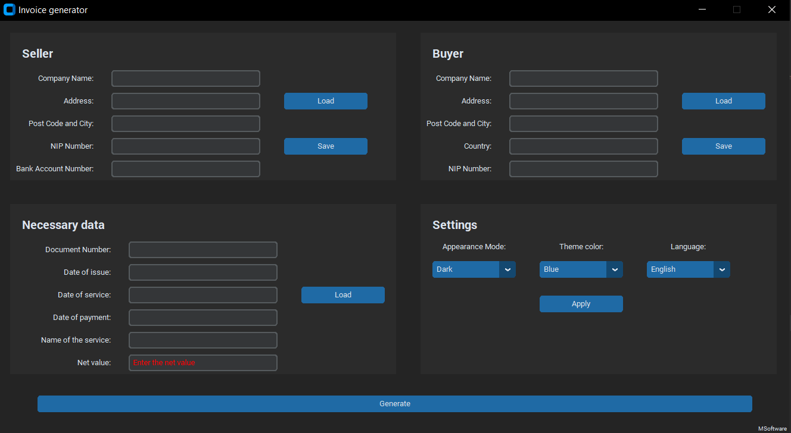
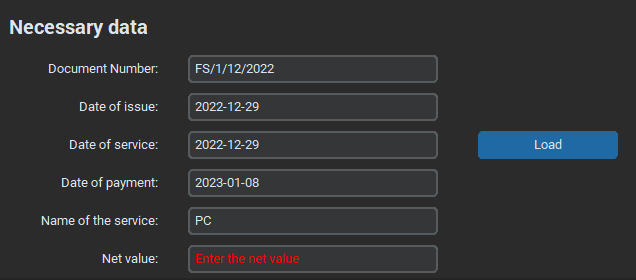
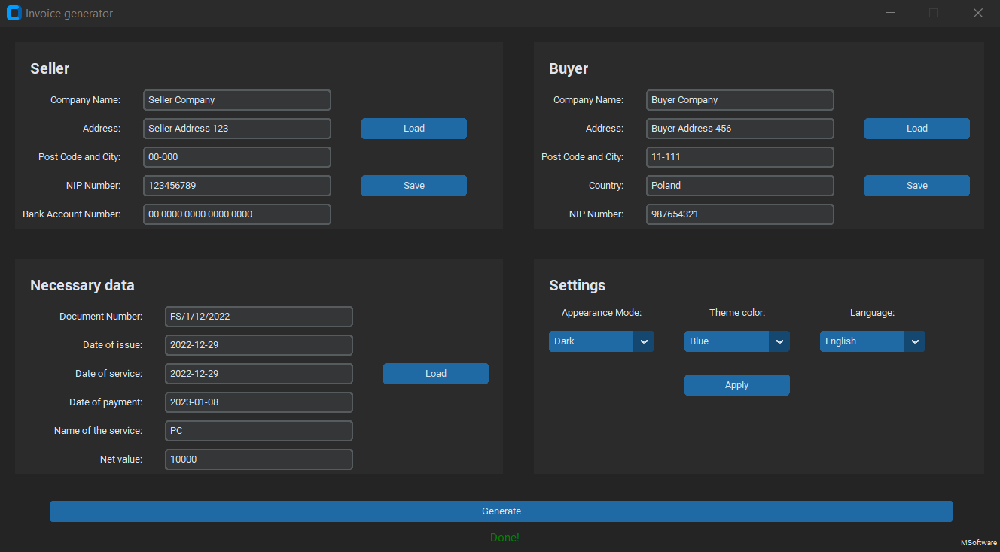
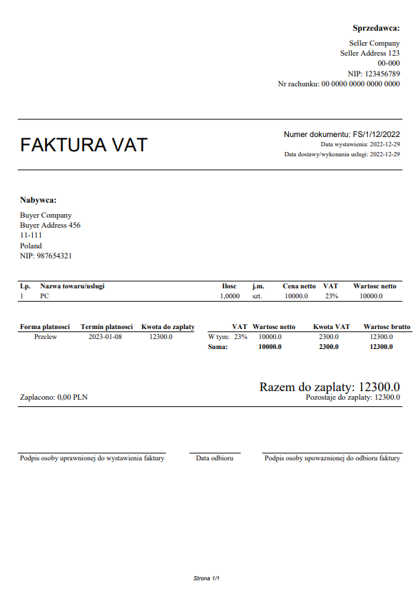

# Invoice Generator
Project commissioned by a friend that allows you to generate an invoice. The generated PDF file is only in Polish 
language. There was no need to add the ability to change the PDF language. 

Application GUI below:

## Application structure
The app includes four sections:
- **Seller** - all needed information about the seller
- **Buyer** - all needed information about the buyer
- **Necessary** data - all needed data (e.g. Date of Payment)
- **Settings** - the possibility to change appearance mode, theme color and application language

### Seller and Buyer
In **Seller** and **Buyer** sections, there are two buttons:
- **Load** - open directory with saved sellers/buyers data
- **Save** - save all information from labels to the file in specific format to sellers/buyers directory

### Necessary data
In **Necessary data** section there is **Load** button which generates next values:
- **Document Number** - number of document with actual month and year in the name. Also includes the number of document
in actual month (always generate "1") - e.g. *FS/1/12/2022*
- **Date of issue** - actual date
- **Date of service** - actual date
- **Date of payment** - actual date + 10 days
- **Name of service** - generate saved name of service (for now is hardcoded)

The **Net value** should be overwritten by the user.

The example of loaded values:

### Settings
There is a possibility to change three settings in app:
- **Appearance Mode**
- **Theme color**
- **Language** 

**Appearance Mode** is changing immediately after choose mode from the combobox, but **Theme color** and **Language** 
demand to click **Apply** button and restart the app. 

## Generating invoice
When all data are completed you can click a **Generate** button on the bottom of the application. After that, you should
see *"Done!"* info below the *Generate* button. Also, on your desktop should be visible a PDF file with 
**Document Number** name. 

If everything is ok, your app should look like this:

And ready PDF on your desktop:

